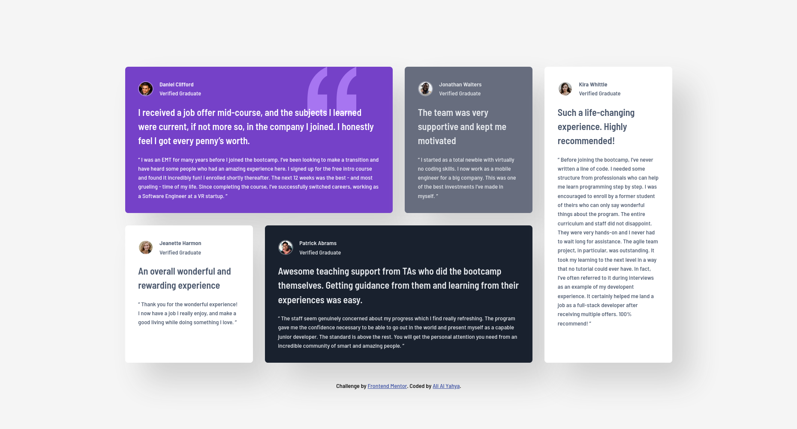

<!-- @format -->

# Frontend Mentor - Testimonials grid section solution

This is a solution to the [Testimonials grid section challenge on Frontend Mentor](https://www.frontendmentor.io/challenges/testimonials-grid-section-Nnw6J7Un7). Frontend Mentor challenges help you improve your coding skills by building realistic projects.

## Table of contents

- [Overview](#overview)
  - [The challenge](#the-challenge)
  - [Screenshot](#screenshot)
  - [Links](#links)
- [My process](#my-process)
  - [Built with](#built-with)
  - [What I learned](#what-i-learned)
    - [HTML & CSS](#html-and-css)
    - [CSS](#css)
    - [SASS](#sass)
  - [Continued development](#continued-development)
    - [HTML](#continued-development--html)
    - [CSS](#continued-development--css)
    - [SASS](#continued-development--sass)
- [AI Collaboration](#ai-collaboration)
- [Author](#author)

## Overview

### The challenge

Users should be able to:

- View the optimal layout for the site depending on their device's screen size

### Screenshot



### Links

- [Solution](https://github.com/ayx234/FM-Four_Card_Feature_Section)
- [Live site](https://ayx234.github.io/FM-Four_Card_Feature_Section)

## My process

### Built with

- Semantic HTML5 markup
- CSS custom properties
- Flexbox
- CSS Grid
- Mobile-first workflow
- SASS

### What I learned

#### HTML and CSS

A visually hidden element with css rule `position: absolute` will still
mess up a grid section layed out with `grid-template-areas`.
The fix is to move wrap the grid items in an element specified for
that lay out and adjust the related css.

Original structure:

```html
<section class="grid-container">
	<p>grid item</p>
	<p>grid item</p>
	<p>grid item</p>
	<p>grid item</p>
</section>
<style>
	.grid-container {
	  display: grid;
	  grid-template-areas: "";
	}
	...
</style>
```

Structure after adding a visually hidden header

```html
<section>
	<h2 class="visually-hidden">hiden header</h2>
	<div class="grid-container">
		<p>grid item</p>
		<p>grid item</p>
		<p>grid item</p>
		<p>grid item</p>
	</div>
</section>
<style>
	.grid-container {
		display: grid;
		grid-template-areas: "";
	}

	.visually-hidden {
		position: absolute;
		width: 1px;
		height: 1px;
		padding: 0;
		margin: -1px;
		overflow: hidden;
		clip: rect(0 0 0 0);
		white-space: nowrap;
		border: 0;
	}
	  ...
</style>
```

#### CSS

- A disadvantage of separating css files is that css variables don't
  appear on vscode intellisense from other files. No extentions work well so far.

#### SASS

##### Setting Up

```bash
npm install sass --save-dev

npx sass --watch <path-to-scss-file> <path-to-compiled-css-file>
```

##### Separating Files

to "use" or "import" a sass file into another sass file,
use `@use "file-name"` or `@import "file-name"` at the top.

`@use` is more modern,preferred and has a performance advantage.

### Continued development

#### Continued-Development--HTML

- Accessibilty
- Semantic HTML

#### Continued-Development--CSS

- Layouts
- Designing
- Animations
- Accessibilities
- New features and properties

#### Continued-Development--SASS

- Functions
- Variables
- Mixins
- More Basics

### AI Collaboration

I used vscode's copilot.

I did it in two iterations and asked for review of accessibility, readability and maintainability:

- The first iteration suggested wrong corrections from my codebase (consfused projects on my github)
- The second, only suggested I add a visually hidden header to my testimonials section.

## Author

- Website - [Ali Al Yahya](https://github.com/ayx234)
- Frontend Mentor - [ayx234](https://www.frontendmentor.io/profile/ayx234)
